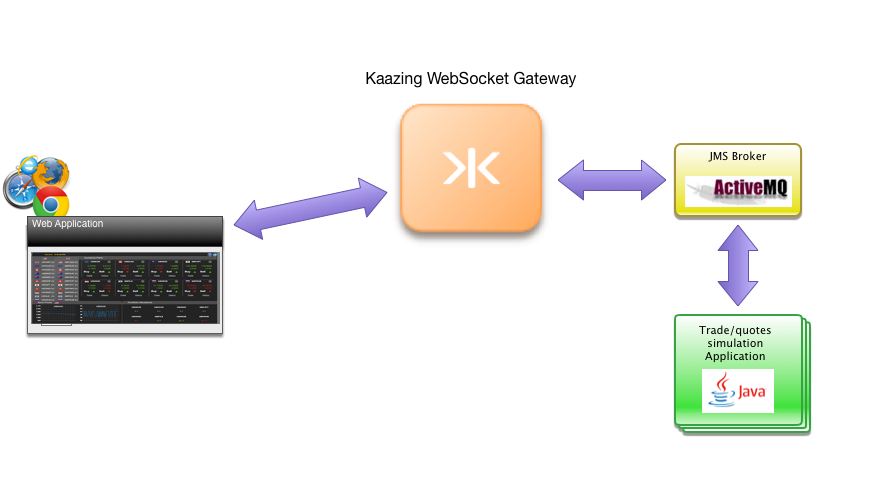

# FX Trader Application

This demo application uses WebSocket to update forex price information in real-time. Simulated price data is provided by a back-end service over JMS (Java Message System) built with Apache ActiveMQ. The demo application allows you to simulate the buying and selling currencies.

To start building your own application with Kaazing Websocket Gateway, visit our [Getting Started](https://kaazing.com/getting-started/) page.  

Please [Contact Us](https://kaazing.com/contact/) for more information. 

Go back to [Demos](http://kaazing.com/products/demos/) page.

