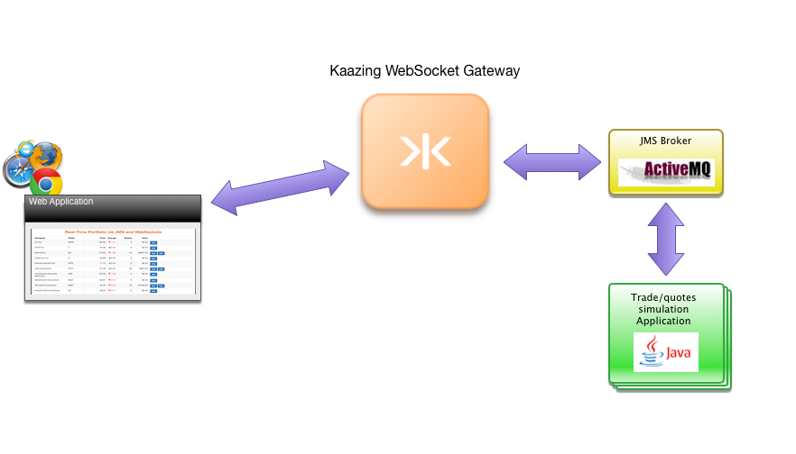

# Real-Time Portfolio via JMS and WebSockets

This demo application uses WebSocket to update stock price information in real-time. Simulated price data is provided by a back-end service over JMS (Java Message System) built with Apache ActiveMQ. The demo application allows you to simulate the buying and selling of stocks with an initial fake balance of $10,000. Although the initial prices shown in the demo are current, the high-speed changes are simulated and should not inform any real world trading decisions.

#To start this demo follow these steps:

**Prerequisite is that you have the Kaazing Websocket Gateway and ActiveMQ up and running (more information [here](https://kaazing.com/doc/5.0/about/setup-guide/index.html))**

1. Install gradle folow the steps [here](https://gradle.org/gradle-download/?_ga=1.147510451.589111043.1485507259);
2. Install NodeJS for Linux go [here](https://nodejs.org/en/download/package-manager/), For Windows and MacOS use the installers [here](https://nodejs.org/en/download/) **You need both NodeJS and NPM**
3. Navigate in the terminal/command line to where you cloned the kaazing demos repository and to the /portfolio folder (ex: ~/demos/portfolio);
4. Navigate to ~/demos/portfolio/stock-trading-service/ and run **gradle installDist**;
5. Navigate to /stock-trading-service/build/install/stock-trading-service/bin. Here you can find for Linux Distribuition/MacOS a script "stock-trading-service" and for Windows a bat "stock-trading-service.bat";
6. Run the script/bat that fits your environmnet by doing "./stock-trading-service" or "stock-trading-service.bat";
7. If your ActiveMQ is **NOT** listening to tcp://localhost:61616 you will have to give the script as the first parameter the URL that your ActiveMQ is listening to ex: "./stock-trading-service tcp://{ACTIVEMQ.IP}:{ACTIVEMQ.PORT}" .Now the ticker that fetched and post the stock data has successfully started!;
8. Navigate to ~/demos/portfolio/portfolio-web/ and run **npm install** to resolve needed dependencie;
9. If your gateway is **NOT** accepting JMS connections on "ws://localhost:8000/jms" you will have to edit this file: ~/demos/portfolio/portfolio-web/server.js. You have to edit line 3 : "uri: 'localhost' to url: '"'{GATEWAY.IP}';
10. Now in ~/demos/portfolio/portfolio-web/ run **node server.js**;
11. Now you are done and you can access either localhost:3000 or {GATEWAY.IP}:3000!
 
To start building your own application with Kaazing Websocket Gateway, visit our [Getting Started](https://kaazing.com/getting-started/) page.  

Please [Contact Us](https://kaazing.com/contact/) for more information.

Go back to [Demos](http://kaazing.com/products/demos/) page.
