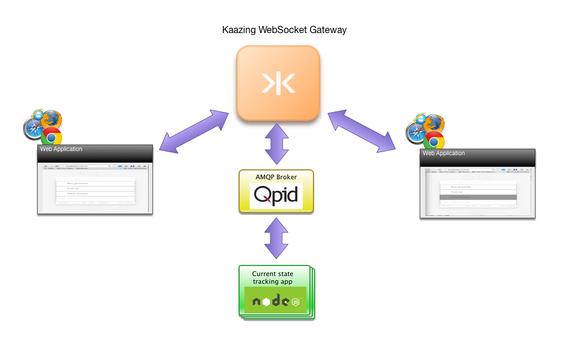

# Kaazing Javascript & ReactJS TodoMVC Example

Application enhances [ReactJS TodoMVC](http://todomvc.com/examples/react/#/) with real-time capabilities.
Kaazing WebSocket enables Web application to use publish/subscribe model. Application notifies other instances when:
- Item is created
- Item is complete/incomplete
- Item text is modified
- Item is ‘busy’ - somebody is working on it to help dealing with the race conditions.

To start building your own application with Kaazing Websocket Gateway, visit our [Getting Started](https://kaazing.com/getting-started/) page.  

Please [Contact Us](https://kaazing.com/contact/) for more information. 

Go back to [Demos](http://kaazing.com/products/demos/) page.
