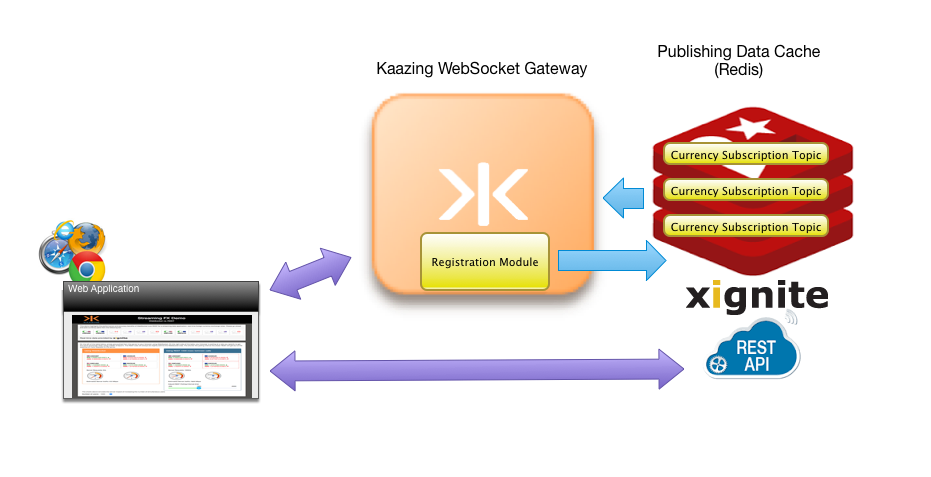

# Streaming FX demo using xIgnite Services

Xignite provides cloud-based financial market data APIs to help emerging companies and established enterprises deliver real-time and reference market data to their digital assets, such as websites and apps. Xignite’s clients include more than 1,000 financial services, media and software companies from disruptive fintech firms, such as Betterment, FutureAdvisor, Motif Investing, Personal Capital, Robinhood, StockTwits, Wealthfront and Yodlee, to leading financial institutions, exchanges and market data vendors including, NASDAQ OMX, SIX Financial Information and BMO.  

On the left of the table below, prices are pushed from the server to your browser using WebSocket. On the right side of the table, your browser is polling at a rate you specify to get the same exchange rates using a REST endpoint. The REST side will always be slightly behind the WebSocket side. The shorter the polling interval the closer REST will get but at the expense of more requests to the server.